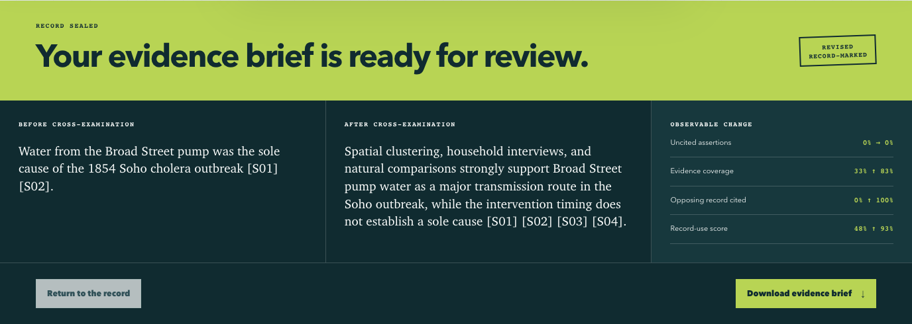
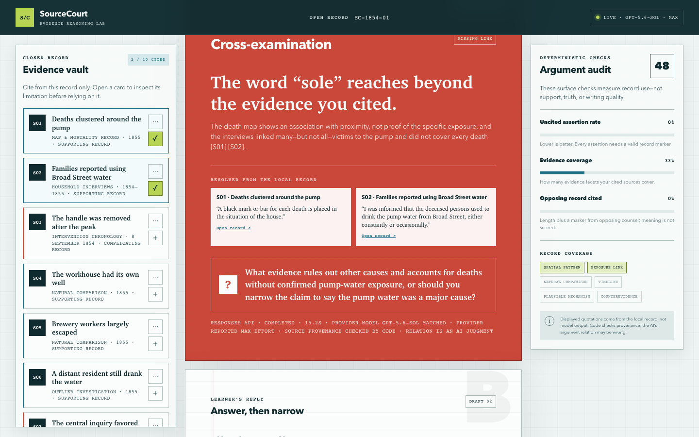
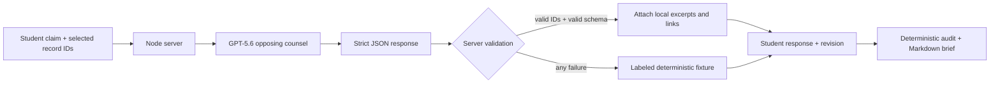

# SourceCourt

> Defend the claim, not the guess.

SourceCourt is a closed-world adversarial reasoning lab for students writing evidence-based historical arguments. The student makes the claim, selects the record, and writes the revision. GPT-5.6 acts only as opposing counsel: it finds one material weakness and asks a source-grounded question. Deterministic code verifies the response contract and provenance, then audits how the learner revised the argument.



**Live demo:** [Open SourceCourt](https://sourcecourt.online/)

## Why it matters

Fluent writing can still be poorly supported. Conventional AI tutors often answer or rewrite for the learner. SourceCourt changes the role of the model: it mounts a high-value challenge grounded in a curated record, while the learner remains responsible for the final position.

The current MVP is deliberately narrow: one seven-minute case on the 1854 Broad Street cholera outbreak, ten inspectable source cards, one cross-examination, and one portable evidence brief.

## Quick judge path

1. [Open the live app](https://sourcecourt.online/). The starter claim says the Broad Street pump was the **sole** cause.
2. Cite `S01` and `S02`, then select **Cross-examine my claim**.
3. Opposing counsel identifies one material weakness and attaches exact record excerpts. Note the attached record IDs; the live model may select a different valid weakness on each run.
4. In **Address the counterevidence**, answer the challenge and cite at least one record ID attached to that challenge. If it raises the intervention chronology and attaches `S03`, you can enter:

   > The decline before handle removal limits the intervention as proof [S03]. I therefore treat it as precautionary and rely on independent exposure comparisons rather than a sole-cause claim.

5. Replace the revised claim with a narrower position that incorporates your run's relevant evidence. For the chronology example, enter:

   > Spatial clustering, household interviews, and natural comparisons strongly support Broad Street pump water as a major transmission route in the Soho outbreak, while the intervention timing does not establish a sole cause [S01] [S02] [S03] [S04].

6. Seal the brief. In the fixture baseline, the surface record-use score moves from `48` to `93`, evidence-facet coverage from `33%` to `83%`, and the opposing-record response signal from `0%` to `100%`.
7. Download the Markdown brief and inspect its sources, timestamp, metrics, and AI-judgment warning.

These are deterministic surface metrics. They can be gamed and are not claims about semantic support, writing quality, historical truth, or learning outcomes.

### Verified live integration

The following capture comes from a successful Responses API run in which the provider reported `gpt-5.6-sol`, reasoning effort `max`, and status `completed`. The browser then completed the learner-revision and evidence-brief path without exposing the key or upstream endpoint.

The public deployment has also passed the complete browser path: health check, live cross-examination, revision, sealing, and Markdown download. Its live response reported the Responses route, `completed` status, provider model `gpt-5.6-sol`, and provider effort `max`.



## Run locally

Requirements: Node.js 22 or newer. There are no runtime dependencies and no install step.

```bash
node server.mjs
```

Open <http://127.0.0.1:4173>. Without a key, SourceCourt runs a permanently labeled, deterministic fixture that preserves the full interaction contract.

To use a live OpenAI or OpenAI-compatible endpoint:

```bash
npm run configure
npm run smoke:live
npm start
```

The configuration helper asks for the Base URL and accepts the API key through hidden terminal input. It writes a gitignored `.env.local` with mode `0600`. The defaults used by the live path are:

```dotenv
OPENAI_MODEL=gpt-5.6-sol
OPENAI_REASONING_EFFORT=max
```

The server tries the Responses API with strict Structured Outputs first. For compatible gateways that do not expose Responses, only HTTP `400`, `404`, `405`, or `422` triggers a Chat Completions compatibility attempt. Both routes retain `max` reasoning effort. Any authentication, timeout, rate-limit, invalid-schema, or provenance failure produces an explicit fixture state; the app never silently lowers reasoning effort.

`max` is a quality-first setting and can add noticeable latency. The request reserves up to 4,096 completion tokens (including reasoning tokens where applicable) and a 120-second timeout so the configured effort is not defeated by an artificially small budget.

`npm run smoke:live` is the final-demo release gate: it requires a completed Responses API request, an upstream request ID, a provider-reported `gpt-5.6-sol` model (or dated snapshot), provider-reported reasoning effort `max`, no incomplete details, and server-verified source provenance. A mismatched provider-reported model or effort forces fixture mode. The Chat Completions compatibility route remains a product resilience path, but it cannot qualify the final demo because some gateways do not echo enough metadata to prove the run. The smoke command never prints the key or Base URL.

For public hosting, set `HOST=0.0.0.0` and use the provider-assigned `PORT`. The deployed server must be able to reach the configured model endpoint; a private-network gateway is not automatically reachable from a public host. See [DEPLOYMENT.md](DEPLOYMENT.md) for the release and network checklist.

## How it works



### What GPT-5.6 does

- Reads the learner's claim and the complete closed record.
- Selects one high-value weakness: overclaim, chronology, causation, missing counterevidence, or source limitation.
- Returns one challenge, one counterpoint, one question, a relation label, and one to three record IDs.

### What code verifies

- The response is a bounded object with every required field.
- Every relation and diagnostic tag belongs to an allowlist.
- Every cited ID exists in the local record; mixed valid/invented citations reject the whole response.
- Displayed excerpts, limitations, titles, and links are reattached from local data, never accepted from the model.
- Audit metrics replay deterministically from the learner's text and record markers.

### What remains an AI judgment

Whether a source semantically supports, qualifies, or contradicts a claim is not deterministic truth. The cross-examination may be wrong. SourceCourt makes provenance auditable and constrains the model; it does not turn model interpretation into fact.

## How we collaborated with Codex

Codex was the primary build collaborator in one build thread rather than the product's runtime tutor. It compared product directions, implemented the zero-dependency Node application and strict Structured Outputs/server-validation boundary, wrote and ran 32 deterministic tests, replayed the complete live browser flow, audited security and accessibility, and assembled the deployment and demo package. SourceCourt was created during the Build Week submission period; its dated commit history begins on July 18, 2026.

The entrant retained the product and editorial decisions: choosing the Education problem, approving the adversarial-learning direction, deciding that the learner—not the model—must write the final claim, reviewing the source excerpts and limitations, accepting the explicit metric boundaries, and approving the public experience and submission. Codex proposed and executed work under those decisions, surfaced risks, and provided checkable evidence; it did not determine historical truth or silently replace a failed live run with a mock.

GPT-5.6 has a separate, narrowly defined role inside the running application. It performs the live semantic cross-examination against the closed record. Server code—not Codex and not the model—validates the contract, reattaches source-owned excerpts, computes the audit metrics, and labels any fallback. This separation lets judges see both required contributions: Codex as the build-and-evaluation collaborator, and GPT-5.6 as the constrained runtime opposing counsel.

## Deterministic audit

| Metric | Definition | Direction |
|---|---|---|
| Uncited assertion rate | Assertions without at least one valid `[Sxx]` marker / all developed assertions | Lower is better |
| Evidence coverage | Distinct covered facets / six case facets | Higher is broader |
| Opposing record response | Response length plus an explicit citation to opposing counsel's record | Surface signal only |
| Record-use score | `35% × cited assertions + 40% × evidence coverage + 25% × opposing-record response` | Workflow summary only |

The browser and server import the same metrics module, so the formulas cannot drift. No model call participates in scoring. A source marker proves only that a record ID was attached—not that the source semantically supports the sentence.

## Evaluation

```bash
npm run check
```

The current suite has 32 passing tests covering the curated-record fingerprint and excerpt limits, citation normalization, short assertions, shared browser/server metrics, response-signal boundaries, unknown claim/response IDs, client citation mismatches, mixed valid/invented model IDs, strict scalar types, unexpected fields, illegal relations, overlong text, invalid confidence/tags, fixture stability, API contracts, GPT-5.6/max request construction, anonymous safety-identifier forwarding, incomplete/mismatched upstream fallback, deployable host binding, proxy-header trust boundaries, rate-limit bypass resistance, JavaScript-module MIME handling, security headers, and credential non-exposure.

Known evaluation boundary: the suite can prove schema, provenance, and metric behavior. It cannot prove that an AI-selected counterargument is the best historical interpretation. A future gold set should be independently labeled by multiple history educators.

## Privacy and security

- The API key is read by the Node server only and is never included in browser state or API responses.
- The app has no accounts, database, analytics, remote storage, or third-party browser scripts.
- Only the claim, cited IDs, curated case record, and a random non-PII browser-session safety identifier are sent to the configured model endpoint.
- The anonymous session identifier follows [OpenAI's safety-identifier guidance](https://developers.openai.com/api/docs/guides/safety-best-practices#implement-safety-identifiers) and contains no username, email, or learner text.
- Requests are limited to 64 KiB and 20 cross-examinations per IP per ten minutes.
- Forwarded client IPs are ignored unless `TRUST_PROXY=1`; enable it only behind an edge that sanitizes forwarding headers. The in-process rate table is bounded, and public multi-instance deployments also require provider-level cost controls.
- A restrictive Content Security Policy, frame denial, MIME sniffing protection, and permissions policy are enabled.
- `.env.local`, Playwright artifacts, and output files are excluded from version control.

## Accessibility

The core path is keyboard-operable and uses semantic buttons, explicit labels, visible focus states, live status regions, dialog focus handling, and text equivalents for color-coded states. Dynamic challenge and final-brief headings receive focus. The layout collapses to one column on small screens and honors reduced-motion preferences.

## Data provenance

The case is based on public historical records from John Snow, Henry Whitehead, the General Board of Health, archival hosts, and later scholarly commentary. Each source card exposes an original link and a limitation. See [DATA_PROVENANCE.md](DATA_PROVENANCE.md) for item-level notes.

## Scope and limitations

- This is one hand-curated historical case, not a general research engine.
- The current metrics describe record use in one task; they are not learning-outcome evidence.
- Source summaries and excerpts require human review before classroom use.
- Gateway compatibility can vary. The fixture is a resilience path, not evidence of a successful live model call.
- SourceCourt does not fact-check the open web, assign truth verdicts, or write a final essay for the learner.

## Project structure

```text
lib/case-data.mjs       Curated closed record
lib/ai.mjs              GPT-5.6 request, schema, and safe fallback
lib/validator.mjs       Provenance validation and deterministic audit
public/                 Accessible zero-build web interface
scripts/configure.mjs   Hidden-input local configuration
scripts/live-smoke.mjs  Sanitized real-model release gate
test/                   Node test suite
```

Built for the OpenAI Build Week 2026 Education track with Codex as the implementation and research collaborator, and GPT-5.6 as the constrained runtime adversary. See [SUBMISSION.md](SUBMISSION.md) for the current submission package and [DEMO_SCRIPT.md](DEMO_SCRIPT.md) for the recording plan.

MIT licensed. Historical source materials remain subject to their respective hosts' terms.
